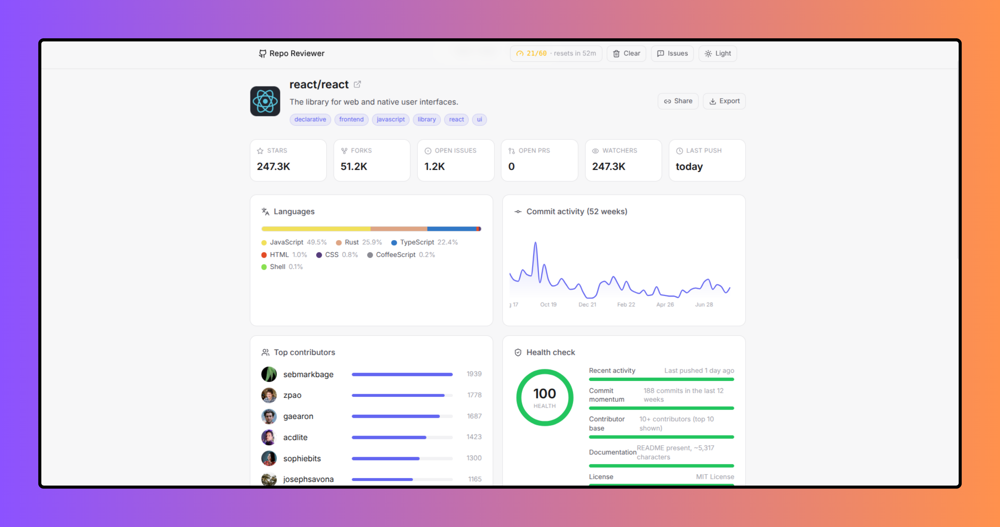

<!--Project Banner-->
<p align="center">
  <a href="https://repo-reviewer.vercel.app/">
    
  </a>
</p>

<p align="left">
  <a href="https://github.com/byllzz/repo-reviewer/stargazers"></a>
  <a href="https://github.com/byllzz/repo-reviewer/forks"></a>
  <a href="https://github.com/byllzz/repo-reviewer/issues"></a>
</p>


# Repo Reviewer

Paste any public GitHub repo (owner/name or a full URL) and get a clean,
single-page review: stats, language breakdown, commit activity, top
contributors, a transparent health score, and a rendered README.

## Run it

```bash
npm install
npm run dev
```

Then search e.g. `facebook/react`, `vuejs/core`, or paste a full
`https://github.com/owner/repo` URL.

## The locked preview

Before you search, every panel is already rendered - with real components,
not an abstract loading skeleton - using plausible placeholder data, then
blurred with a centered lock icon. Searching "unlocks" each panel: the
blur and lock icon animate away together, revealing the real data in
place. Panels re-lock during a subsequent search and on an error, so
there's never a moment showing stale results with no explanation.

This is `components/Locked.tsx` (a thin wrapper: blur/opacity via CSS
transition, the lock icon via Framer Motion's `AnimatePresence`) combined
with `lib/placeholder.ts` (a fixture matching the real `RepoReview` shape)
- every panel component only ever needs to know how to render a
`RepoReview`, real or fake.

## The README panel

Tabs between a rendered **Preview** (markdown + GitHub-flavored tables/
checklists) and **Raw** (the source text, monospaced) - `components/ReadmeTabs.tsx`.

## Stack

React + TypeScript + Vite + **Tailwind CSS v4** (via `@tailwindcss/vite`,
no `tailwind.config.js` or PostCSS config needed - theme tokens live in
`src/styles/index.css` under `@theme`), Zustand for state, Recharts for the
commit-activity chart, react-markdown + remark-gfm for the README render,
Framer Motion for the entrance/gauge animations, lucide-react for icons.

## How it works

- `lib/github.ts` - a small GitHub REST API client. Fetches repo info,
  languages, contributors, commit activity, README, and open PR count in
  parallel. Handles GitHub's quirks: the commit-activity endpoint can
  return `202` while stats are computed async (retried automatically), and
  rate-limit / not-found errors are surfaced as readable messages instead
  of raw HTTP codes.
- `lib/health.ts` - a **transparent** health-score heuristic (recency,
  commit momentum, contributor count, docs, license, issue backlog). Every
  factor is shown in the UI with its own explanation - this is explicitly
  not presented as an objective "quality score," just one readable signal.
- `lib/store.ts` - Zustand store for the current review, loading/error
  state, and recent searches (persisted to `localStorage`).
- `lib/placeholder.ts` - fixture data conforming to the real `RepoReview`
  type, used to render every panel in its locked state before a search.
- `components/Locked.tsx` - the blur/lock-icon wrapper used around every
  data panel.
- `components/ReadmeTabs.tsx` - Preview/Raw tabs for the README panel.
- `components/` - one component per panel (stats grid, language bar,
  commit chart, contributors, health gauge), composed in `App.tsx`.

## Notes on GitHub's API

- Unauthenticated requests are capped at 60/hour per IP. This app doesn't
  use an access token, so heavy testing may hit that limit - the error
  state will tell you when it resets.
- The commit-activity endpoint occasionally needs GitHub to compute stats
  for a repo it hasn't cached yet, hence the retry logic - if it never
  resolves, the chart just shows "not available yet" instead of failing
  the whole page.

## Ideas to extend

- Add a personal access token input to raise the rate limit to 5,000/hour
- Compare two repos side by side
- Cache recent reviews in IndexedDB so revisiting a repo is instant

## Contributing

Pull requests are welcome. Please keep new hooks dependency-free, include
a demo, and follow the existing code style (see any file in `src/hooks`
for the expected shape: a short docblock, clean TypeScript, proper
cleanup in `useEffect`).

## Deploy

Deployed on Vercel. Push to your repo and import it in the Vercel dashboard - no config needed, it's a standard Vite app.

If you enjoyed this project, consider giving it a ⭐ on GitHub. It helps others discover the project and motivates future improvements.

# License (MIT)

This project is licensed under the MIT License.

```text
MIT License

Copyright (c) 2026 Bilal Malik

Permission is hereby granted, free of charge, to any person obtaining a copy
of this software and associated documentation files (the "Software"), to deal
in the Software without restriction, including without limitation the rights
to use, copy, modify, merge, publish, distribute, sublicense, and/or sell
copies of the Software, and to permit persons to whom the Software is
furnished to do so, subject to the following conditions:

The above copyright notice and this permission notice shall be included in all
copies or substantial portions of the Software.

THE SOFTWARE IS PROVIDED "AS IS", WITHOUT WARRANTY OF ANY KIND, EXPRESS OR
IMPLIED, INCLUDING BUT NOT LIMITED TO THE WARRANTIES OF MERCHANTABILITY,
FITNESS FOR A PARTICULAR PURPOSE AND NONINFRINGEMENT. IN NO EVENT SHALL THE
AUTHORS OR COPYRIGHT HOLDERS BE LIABLE FOR ANY CLAIM, DAMAGES OR OTHER
LIABILITY, WHETHER IN AN ACTION OF CONTRACT, TORT OR OTHERWISE, ARISING FROM,
OUT OF OR IN CONNECTION WITH THE SOFTWARE OR THE USE OR OTHER DEALINGS IN THE
SOFTWARE.
```
© 2026 Repo-Reviewer. All rights reserved.
